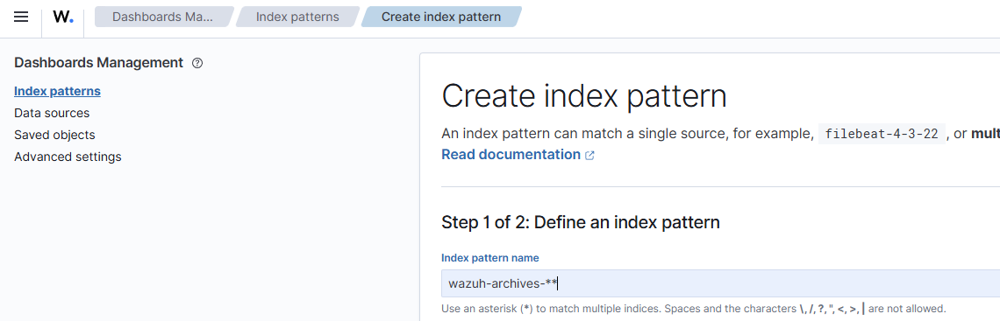

# Báo cáo Project SOC Automation (SIEM SOAR)
## Mô hình thiết kế
 
 Máy Windows/Ubuntu Client, 
 Máy Wazuh Server, 
 Máy thehive server


Trong workflow này tất cả mọi hành động đều được thực hiện qua hệ thống SOAR dùng shuffle. 

hệ thống sẽ dùng rule truy xuất từ logs để phát hiện mối đe dọa đến máy client (được cài wazuh agent ), kiểm tra thông tin hash trên virustotal để làm giàu thông tin,

sau đó gửi báo cáo về thehive để quản lí case các sự kiện, rồi sẽ tự động chặn ip tới nguồn độc hại bằng cách dùng agent-control trong wazuh server.

Đây là homelab mang tính demo SIEM, SOAR, endpoint agent, tuy chưa được hoàn thiện lắm nhưng cũng khá là hữu ích cho người mới! 
## Cài đặt các hệ thống
* Cài đặt sysmon trên máy Windows client
* Cài đặt wazuh server trên một VPS(ubuntu)
```
Install Wazuh 4.7

curl -sO https://packages.wazuh.com/4.7/wazuh-install.sh && sudo bash ./wazuh-install.sh -a
```

Sau khi cài xong sẽ có credential của admin:
```
08/08/2025 19:46:25 INFO: Initializing Wazuh dashboard web application.
08/08/2025 19:46:25 INFO: Wazuh dashboard web application initialized.
08/08/2025 19:46:25 INFO: --- Summary ---
08/08/2025 19:46:25 INFO: You can access the web interface https://<wazuh-dashboard-ip>:443
    User: admin
    Password: z6twwuaO8N8MW2gh+y9IMrgyqYA.4ADQ
08/08/2025 19:46:25 INFO: Installation finished.
```
truy cập ``ip-wazuh`` để vào web server wazuh.

* Cài đặt thehive server trên một VPS(ubuntu)
``https://docs.strangebee.com/thehive/installation/step-by-step-installation-guide/#thehive-installation-and-configuration``

cài đặt thehive theo hướng dẫn chi tiết trên document của họ. sau khi cài đặt xong, sẽ có thể truy cập web ``ip-vps:9000``


## Trigger alert trên Wazuh bằng việc cài và chạy tập lệnh tấn công Mimikatz
trước hết để trigger được alert thì phải config lại file ``ossec.conf`` để nó thu tất cả log.


chỉnh hết 4 dòng trong file conf này thành yes


tiếp theo enable archives ở trong file ``/etc/filebeat/filebeat.yml`` thành true.
Sau đó ta khởi động lại service của chúng:
```
root@wazuh:~# systemctl restart wazuh-manager.service
root@wazuh:~# systemctl restart filebeat
```

tiếp theo, ta truy cập vào web wazuh vào tạo thêm một ``index pattern``, ở trong phần ``Dashboard Management``, lấy tên là ``wazuh-archives-**``:



đến step2 thì ta chọn timefield là ``timestamp`` và hoàn tất tạo index pattern.


Down và chạy lệnh mimikatz trên máy windows client, rồi truy cập vào website wazul server, ta chuyển index pattern thành ``wazuh-archives`` như ta vừa tạo và tìm kiếm từ khóa mimikatz:


kết quả là đã ghi nhận được log, nhưng chưa có alert và rule description tương ứng:


ta nhận thấy rằng khi tạo một rule mới để trigger alert về việc client chạy lệnh mimikatz, ta nên chú ý vào ``data.win.eventdata.originalFileName`` thay vì ``data.win.eventdata.image``. bởi vì dù cho attacker có đổi tên file thì ta vẫn detect được hoạt động của chúng.

Tiếp theo ta tạo một rule mới, Server Management -> Rule -> Manage rules, rồi tìm local rule và nhấn chỉnh sửa:


thêm đoạn rule sau vào file:
```
  <rule id="100002" level="14">
    <if_group>sysmon_event1</if_group>
    <field name="win.eventdata.originalFileName" type="pcre2">(?i)mimikatz\.exe</field>
    <description>Mimikatz usage detected </description>
    <mitre>
      <id>T1003</id>
    </mitre>
  </rule>
```

Sau khi đã thêm rule mới, bây giờ khi ta chạy lệnh mimikatz trên windows client, wazuh sẽ ghi nhận log và cảnh báo alert ``Mimikatz usage detected``:


## Kết nối đến Shuffle(SOAR), gửi alert đến thehive và active respond.

Trước hết ta cần lấy api từ Shuffle rồi thêm đoạn code sau vào file ``/var/ossec/etc/ossec.conf``: 

Như vậy, mỗi khi hệ thống ghi nhận máy client windows chạy lệnh mimikatz, sẽ gửi một alert đến webhook của shuffle.

Đây là workflow cho case này, mình thấy giao diện của shuffle khá dễ sử dụng vì trước đó đã tiếp xúc với n8n -  một trình aumation khá tương đồng.


Sau khi nhận log từ wazuh, sẽ lấy sha256 hash và enrich bằng cách sử dụng virustotal, sau đó sẽ gửi alert đến thehive để SOC Analyst nhận và quản lí các case.


### Tự động chặn kết nối của máy nạn nhân đến kết nối nguy hiểm, active response by agent 

sau khi đã tự động gửi về thehive để quản lí case, tiếp theo chúng ta sẽ hoàn thiện quy trình bằng cách
tự động phản ứng lại với mối nguy hiểm thông qua cơ chế cài đặt agent tại endpoint.

trước tiên, ta sẽ cài wazuh agent trên máy ubuntu client, bằng lệnh sau:

```
wget https://packages.wazuh.com/4.x/apt/pool/main/w/wazuh-agent/wazuh-agent_4.12.0-1_amd64.deb && sudo WAZUH_MANAGER='137.184.69.196' WAZUH_AGENT_NAME='ubuntu' dpkg -i ./wazuh-agent_4.12.0-1_amd64.deb
sudo systemctl daemon-reload
sudo systemctl enable wazuh-agent
sudo systemctl start wazuh-agent
```

từ đây, ta có thể kiểm soát và điều khiển agent này từ wazuh server:


ta cần phải thực hiện thử điều khiển agent bằng lệnh, trước khi đẩy lệnh đó lên trình SOAR của shuffle.

ta sẽ chạy lệnh firewall-drop từ wazuh server:


oke, kiểm tra lại bằng iptable trên máy client ubuntu, ta thấy lệnh từ wazuh server gửi tới agent đã thực hiện thành công

kiểm tra log trên máy client ubuntu để xem cấu trúc câu lệnh được thực thi thực sự như nào:


```
"parameters":{"extra_args":[],"alert":{"data":{"srcip":"8.8.8.8"}},"program":"active-response/bin/firewall-drop"}
```

từ đây, ta điền các thông tin tương ứng vào wazuh trên shuffle để hoàn thành trình tự động:


vậy là hoàn thành workflow trên shuffle, có thể cải tiến bằng các case khác chi tiết hơn; xử lí thêm các bước cho chuyên nghiệp và khách quan hơn